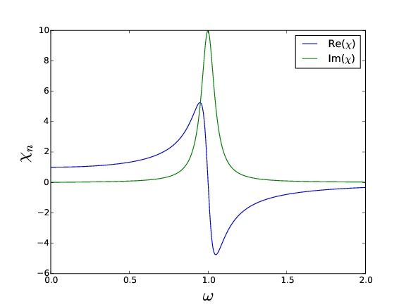

## General resonator

Assume the driving force have the form $F(t) = F_0 e^{-i \omega t}$

Equation of motion

$$ \ddot{x}(t)+\eta \dot{x}(t)+\omega_{0}^{2} x(t)=\frac{F_{0}}{m} e^{-i \omega t} $$

with a response of form $x(t) = \tilde x_0 e^{-i\omega t}$, we get

$$ \tilde{x}*{0}(\omega)=\frac{F*{0} / m}{\omega_{0}^{2}-\omega^{2}-i \eta \omega} $$

## General susceptibility

General susceptibility is defined as

$$ \chi_{n}(\omega) = \frac{\tilde x_0(\omega_0)}{\tilde x_0(\omega)}=\frac{\omega_{0}^{2}}{\left(\omega_{0}^{2}-\omega^{2}\right)-i \eta \omega} $$

Real ($\chi'$) and imaginary ($\chi''$) part of susceptibility ($\chi$), as a function of $\omega / \omega_0$, where $\chi = \chi' + i\chi''$. via Bailey's course note

- Imaginary part ($\chi''$)
  - Symmetric, gaussian function
  - FWHM
- Real part ($\chi'$)
  - Antisymmetric
  - $\chi_n \to 1$ when $\omega \to 0$
  - $\chi_n \to 0$ when $\omega \to \infty$

## Q-factor, or quality factor

Q-factor relate to the imaginary part, or the $\eta$ term=

See [Anelasticity, damping](https://www.notion.so/Anelasticity-damping-7793e6ac446e4b1293afd2661d44bb47).

## Phase

The phase of the response is defined by

$$ \tilde{\chi}*{n}=\left|\chi*{n}\right| e^{i \delta} \quad \tan \delta=\frac{\chi^{\prime \prime}}{\chi^{\prime}} $$

## Kramers-Kronig relations

## General stimulus and general response

$\tilde{R}=\tilde{\chi} \tilde{S}$

$P(t)=S(t) \frac{d R(t)}{d t}$

## Power consumption

$P(t)$ measures the power absorbed per unit space.

$$ \langle P\rangle=\frac{S_{0}^{2} \omega}{2} \chi^{\prime \prime} $$

## Dielectric loss

## Plasma