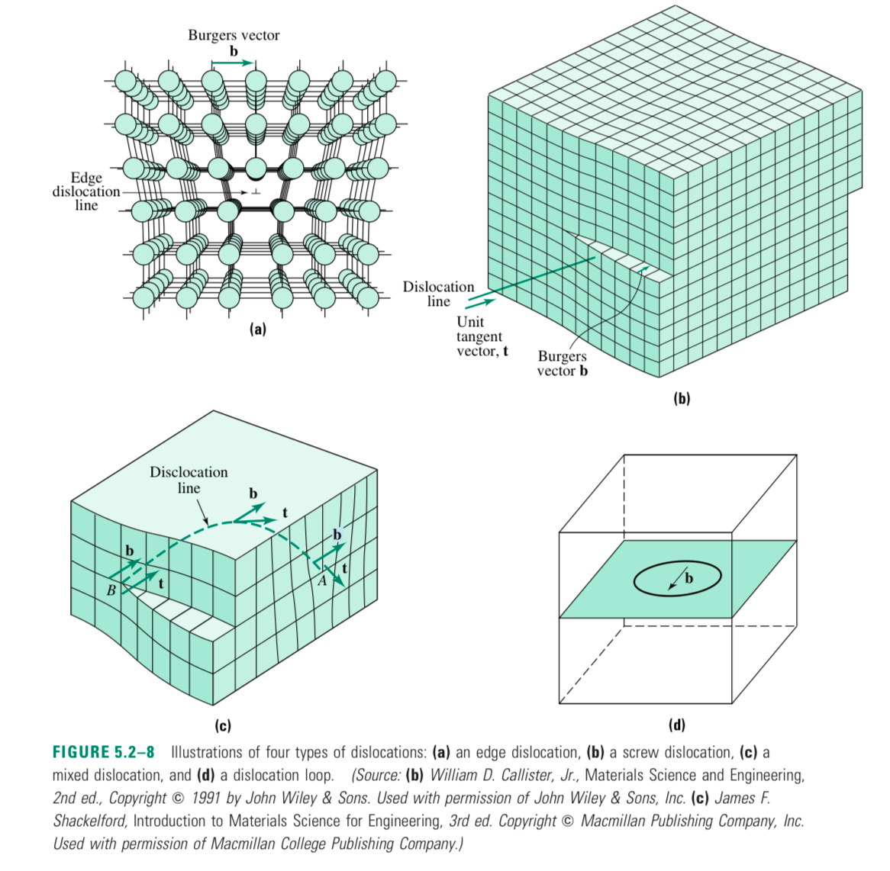
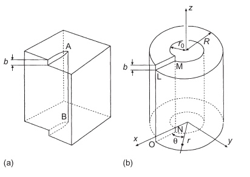

## Dislocation basics

### Burgers vector, tangent vector, and slip plane

- Burgers vector $\vec b$
  - The same dislocation shares the same $\vec b$
- Unit tangent vector $\vec t$
- Slip plane $\vec b \times \vec t$

#### Edge dislocation

- Edge dislocation $\vec b \perp \vec t$
- Edge dislocation symbol $\perp$
  - Vertical line: half plane, broken bonds
  - Horizontal line: slip plane

#### Screw dislocation

- Screw dislocation $\vec b \parallel \vec t$

### Slip system

Usually, the slip system corresponds to the highest-density plane.

## Force on dislocation: Peach-Koehler force

The Peach-Koehler formula gives us the force  $\vec f_\text{d}$ on a dislocation line under a stress field $[\sigma]$:

$$
\frac{\vec f_\text{d}}{\delta l} = (\sigma \cdot \vec b) \times \hat l
$$

### Properties

The shear stress need to have a component in the $\vec b$ direction; then consider the plane, assume pure shear, then $\sigma \, \vec b$ is perpendicular to $\vec b$ because, assume pure shear with a magnitude of $\tau$, we have
$$
\sigma_{ij} \, b_j =  \begin{bmatrix}
0 & \tau \\
\tau & 0 \\
\end{bmatrix} \begin{bmatrix}
b_x \\
b_y \\
\end{bmatrix} = \begin{bmatrix}
\tau\,b_y \\
\tau\,b_x \\
\end{bmatrix}
$$

Here, the Burgers vector is $\vec b$ and the direction of the dislocation is given by a unit vector $\hat l$.

This force controls the movement of the dislocation (line). Because of the dot product, the force/movement will always be perpendicular to the dislocation line.

## Strain, stress, and self-energy of dislocation

With the Peach-Koehler formula, we are able to obtain the force on a dislocation line under a stress field. If we have the stress field of another dislocation, we can calculate the force “between” the two dislocations.

## Strain field, stress field of a dislocation

Here, $G$ denotes the shear modulus of the system and $\nu$ denotes the Poisson ratio.

###  Results

|             | Screw dislocation                                            | Edge dislocation                                             |
| ----------- | ------------------------------------------------------------ | ------------------------------------------------------------ |
| Strain      | $\epsilon_{z\theta} = \frac{b}{4\pi}\left(\frac{1}{r}\right)$ |                                                              |
| Stress      | $\sigma_{z\theta} = \frac{Gb}{2\pi}\left(\frac{1}{r}\right)\sigma_{z\theta} = \frac{Gb}{2\pi}\left(\frac{1}{r}\right)\sigma_{z\theta} = \frac{Gb}{2\pi}\left(\frac{1}{r}\right)$ | $\sigma_{z\theta} = \frac{Gb}{2\pi(1-\nu)}\left(\frac{1}{r}\right)$ |
| Self energy | $\frac{Gb^2}{4\pi} \ln\frac{R_\text{max}}{R_\text{c}}$       | $\frac{Gb^2}{4\pi(1-\nu)} \ln\frac{R_\text{max}}{R_\text{c}}$ |

Important points:

1. Stiffer materials have higher dislocation energy, $U_e \propto G$.
2. Comparatively, edge dislocation will have higher energy because of the $\frac{1}{1-\nu}$ term.
3. Strain falls off as $1/r$.

## See also

- [[Point defects (0D defects)]], which has more of a thermodynamic aspect.
- *Science and Design of Engineering Materials* has a really good chapter on this topic.
- [Lecture 9 - Forces on Dislocations.pdf (imechanica.org)](https://imechanica.org/files/Lecture%209-%20Forces%20on%20Dislocations.pdf)
- Lubarda, Vlado A. “Dislocation Burgers Vector and the Peach–Koehler Force: A Review.” *Journal of Materials Research and Technology*, vol. 8, no. 1, Jan. 2019, pp. 1550–65. *ScienceDirect*, https://doi.org/10.1016/j.jmrt.2018.08.014.
- Peach, M., and J. S. Koehler. “The Forces Exerted on Dislocations and the Stress Fields Produced by Them.” *Physical Review*, vol. 80, no. 3, Nov. 1950, pp. 436–39. *APS*, https://doi.org/10.1103/PhysRev.80.436.
