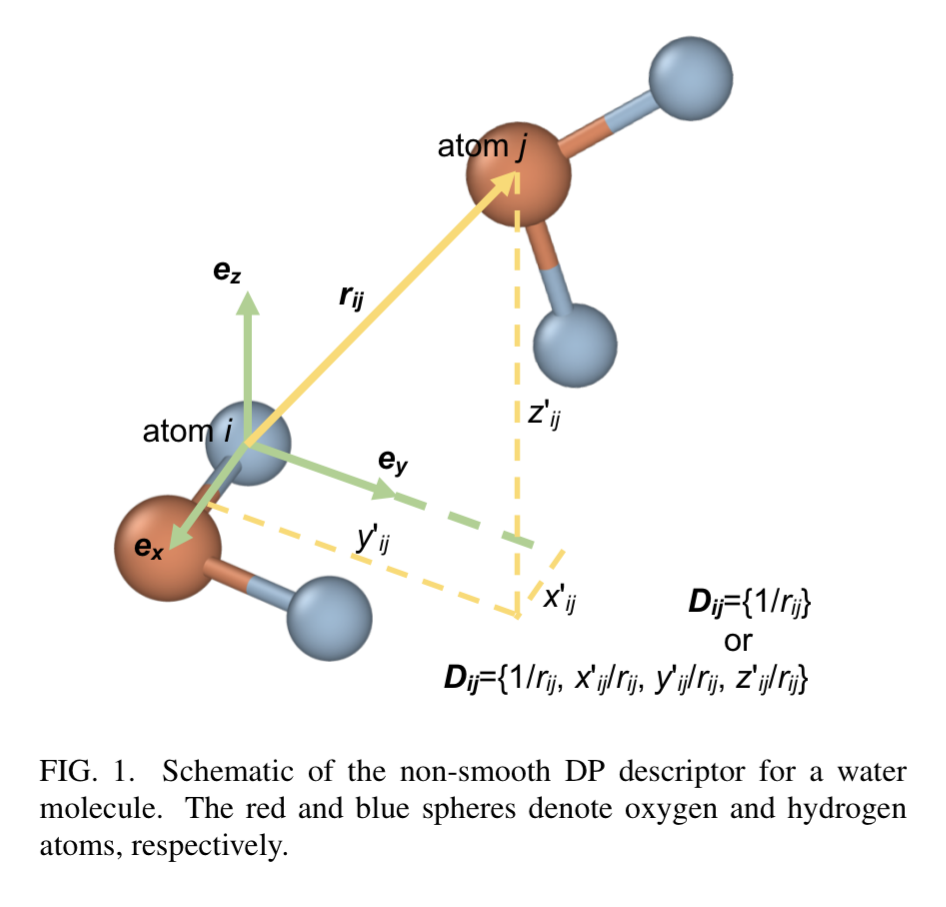
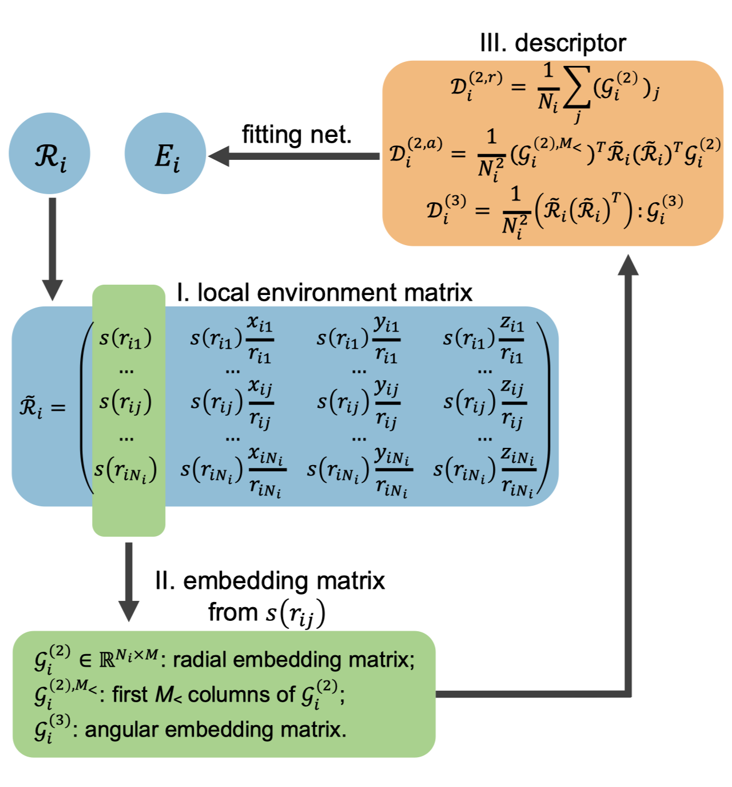

## The vanilla non-smooth DP

### Overview

$$
\ce{
\underset{global coordinate}{$(x,y,z)$} ->[\mathcal{R}][rotation] \underset{local coordinate}{$(x',y',z')$} -> \underset{descriptor}{$\{\mathcal{D}_{ij}\} $} -> $E_i$
}
$$

### The descriptor $\{\mathcal{D}_{ij}\}$

- Radial information: $1/r_{ij}$
- Distance info: $(x' / r_{ij}, y' / r_{ij}, z' / r_{ij})$.

{ style='max-width: 300px' }

## The smooth DP (DP-SE)

### Overview

A simplified description of the process of constructing the energy is the following:

$$
\ce{\underset{atom environment}{$\mathcal{R}_i$} ->[DNN][embedding network]\underset{embeding matrix}{$\mathcal{G}_i$} -> \underset{descriptor}{$\mathcal{D}_i$} ->[DNN][fitting network] \underset{energy}{$E_i$}}
$$

A more complete depiction can be seen in (Wen et al., 2022) as shown in the following figure:

{ style='max-width: 300px' }

### Nomenclature

| Variable                | Description                         | Dimension  |
| ----------------------- | ----------------------------------- | ---------- |
| $\mathcal{R}_i$         | the environment matrix for atom $i$ | $(N_i, 3)$ |
| $\tilde{\mathcal{R}}_i$ | the augmented matrix for atom $i$   | $(N_i, 4)$ |
| $\mathcal{G}_i$         | the embedding matrix                | $(N_i, M)$ |
| $\mathcal{D}_i$         | the smooth descriptors              |            |
| $E_i$                   | the energy of atmo $i$              |            |

### Variants of the descriptor

The superscript enclosed in parenthesis denote the variant of the descriptor, including

| Description                                                  | Embedding               | Descriptor              |
| ------------------------------------------------------------ | ----------------------- | ----------------------- |
| Two-body embedding with radial distance between neighbouring atoms | $\mathcal{G}^{(2,r)}_i$ | $\mathcal{D}^{(2,r)}_i$ |
| Two-body embedding with coordinates of the neighbour atoms   | $\mathcal{G}^{(2,a)}_i$ | $\mathcal{D}^{(2,a)}_i$ |
| Two-body embedding with the angle between neighbour atoms in the embedding term | $\mathcal{G}^{(3)}_i$   | $\mathcal{D}^{(3)}_i$   |

In the DeePMD-kit implementation, they are named `se_e2_r`, `se_e2_a`, and `se_e3`, respectively. The accuracy and resolution between the three descriptor variants are $\mathcal{D}_i^{(3)} > \mathcal{D}_i^{(2,a)} > \mathcal{D}_i^{(2,r)}$ (Wen et al., 2022).

### Implementation

The implementation details in DeePMD-kit are described in the API documentation for the following functions:

- [`depend.fit.ener.EnerFitting`](https://docs.deepmodeling.com/projects/deepmd/en/master/api_py/deepmd.fit.html#deepmd.fit.ener.EnerFitting)
- [`deepmd.utils.network.embedding_net`](https://docs.deepmodeling.com/projects/deepmd/en/master/api_py/deepmd.utils.html#deepmd.utils.network.embedding_net)

The specific shape of network (adjacent layers have same or twice the width) allows the use of *ResNet* (deep residual neural network) (He et al., 2015).

## References

- [Atom Type Embedding — DeePMD-kit documentation](https://docs.deepmodeling.com/projects/deepmd/en/master/development/type-embedding.html)
- [DeePMD 描述符 se_a 前向和反向](https://bytedance.feishu.cn/wiki/wikcnfcYL9NA1L1XwnWUMZ0V9jf)
- [deepmd_on_pytorch/model.py at master · shishaochen/deepmd_on_pytorch (github.com)](https://github.com/shishaochen/deepmd_on_pytorch/blob/master/deepmd_pt/model.py)
- [deepmd-kit/network.py at 3e54fea7aedf5e1f68fa534f9c692f2be6077da9 · deepmodeling/deepmd-kit (github.com)](https://github.com/deepmodeling/deepmd-kit/blob/3e54fea7aedf5e1f68fa534f9c692f2be6077da9/deepmd/utils/network.py#L97=)
- [deepmd.utils package — DeePMD-kit documentation (deepmodeling.com)](https://docs.deepmodeling.com/projects/deepmd/en/master/api_py/deepmd.utils.html#module-deepmd.utils.network)
- [9.1. How to tune Fitting/embedding-net size? — DeePMD-kit documentation (deepmodeling.com)](https://docs.deepmodeling.com/projects/deepmd/en/master/troubleshooting/howtoset_netsize.html)
- [3.1. Overall — DeePMD-kit documentation (deepmodeling.com)](https://docs.deepmodeling.com/projects/deepmd/en/latest/model/overall.html)
- He, K., Zhang, X., Ren, S., & Sun, J. (2015). Deep Residual Learning for Image Recognition. *ArXiv:1512.03385 [Cs]*. http://arxiv.org/abs/1512.03385
- Wen, T., Zhang, L., Wang, H., E, W., & Srolovitz, D. J. (2022). Deep Potentials for Materials Science. *ArXiv:2203.00393 [Cond-Mat, Physics:Physics]*. http://arxiv.org/abs/2203.00393
- Zhang, L., Han, J., Wang, H., Saidi, W. A., Car, R., & Weinan, E. (2018). End-to-end symmetry preserving inter-atomic potential energy model for finite and extended systems. *Proceedings of the 32nd International Conference on Neural Information Processing Systems*, 4441–4451. https://arxiv.org/abs/1805.09003

