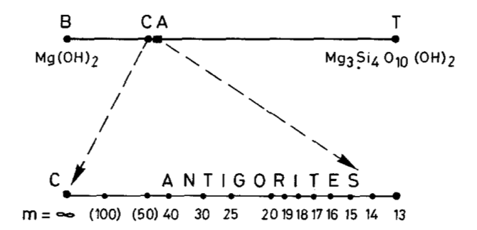

## Serpentine minerals categorization based on $\ce{Mg} / \ce{Si}$ ratio

The brucite–lizardite–talc line: $\ce{x MgO * y SiO2 * Mg(OH)2}$

## Antigorite

Serpentine formula $\ce{M_{3m-3}T_{2m}O_{5m}(OH)*{4m-6}}$ / $\ce{Mg*{3m-3}Si_{2m}O_{5m}(OH)_{4m-6}}$

The periodicity $m$ is related to cell size and is also an “indicator” for the depletion of $\ce{Mg(OH)2}$ against lizardite.

>  Antigorite is not a serpentine polymorph *strictu sensu*, because of the discrete $\ce{Mg(OH)2}$ depletion (Capitani & Mellini, 2004)

> The $m$ values of antigorite commonly range from 23 to 14 in natural metamorphic serpentinites. (Shen et al., 2020)

When $m \to \infty$ (no depletion), we get lizardite $\ce{Mg3Si2O5(OH)4}$.

### **The depletion formula**

$$ \ce{$\underset{\text{lizardite}}{\ce{m Mg3Si2O5(OH)4}}$ -> $\underset{\text{antigorite}}{\ce{Mg_{3m-3}Si_{2m}O_{5m}(OH)_{4m-6}}}$ + $\underset{\text{brucite}}{\ce{3 Mg(OH)2}}$} $$

### $m$ valve vs. $PT$

> Low $m$ values are more stable at high temperature (Kunze 1961; Trommsdorff 1983; Mellini et al. 1987; Uehara and Kamata 1994). (Shen et al., 2020)

> Wunder et al. (2001) performed an experimental study at 350–710 °C, 2–50 kbar in the simple MSH system and found that the a-axis (related to the $m$ value) is roughly negatively correlated with temperature but positively correlated with pressure. (Shen et al., 2020)

### **Number of atoms** = $18m - 15$

| Periodicity ($m$) | Formula ($\ce{Mg_{3m-3}Si_{2m}O_{5m}(OH)_{4m-6}}$) | \# atoms ($18 m - 15$) |
| ----------------- | -------------------------------------------------- | ---------------------- |
| 13                | $\ce{Mg36Si26O65(OH)46}$                           | 219                    |
| 17                | $\ce{Mg48Si34O85(OH)62}$                           | 291                    |
| 23                | $\ce{Mg66Si46O115(OH)86}$                          | 399                    |

## References

- Capitani, G., & Mellini, M. (2004). The modulated crystal structure of antigorite: The m = 17 polysome. *American Mineralogist*, *89*(1), 147–158. https://doi.org/10.2138/am-2004-0117
- Mellini, M., & Zanazzi, P. F. (1987). Crystal structures of lizardite-1T and lizardite-2H1 from Coli, Italy. *American Mineralogist*, *72*(9–10), 943–948.
- Shen, T., Zhang, C., Chen, J., Hermann, J., Zhang, L., Padrón-Navarta, J. A., Chen, L., Xu, J., & Yang, J. (2020). Changes in the cell parameters of antigorite close to its dehydration reaction at subduction zone conditions. *American Mineralogist*, *105*(4), 569–582. https://doi.org/10.2138/am-2020-7159